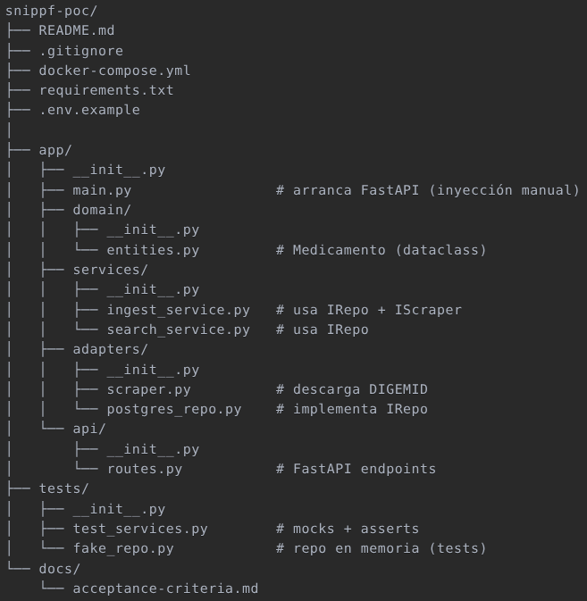

```markdown
# 🚀 SNIPPF PoC

**Catálogo Farmacéutico DIGEMID** – Web-scraping, API y búsqueda **< 3 s**, sin costo.

---

## 📌 ¿Qué valida este PoC?

| Característica  | Objetivo                                       |
| --------------- | ---------------------------------------------- |
| **Scraping**    | Descargar y limpiar el Excel diario de DIGEMID |
| **Ingesta**     | Persistir datos en Postgres sin duplicados     |
| **Búsqueda**    | Endpoint público con filtros y autocompletado  |
| **Performance** | ≤ 3 s desde la petición hasta la respuesta     |
| **SOLID**       | Arquitectura monolito con principios aplicados |
| **Infra**       | Docker Compose local (0 USD)                   |

---

## 📁 Estructura del proyecto
```

snippf-poc/
├── app/
│ ├── api/routes.py # FastAPI /search & /ingest
│ ├── domain/entities.py # Medicamento (dataclass)
│ ├── services/ # Lógica de negocio
│ │ ├── ingest_service.py
│ │ └── search_service.py
│ ├── adapters/ # Acceso a datos
│ │ ├── scraper.py
│ │ └── postgres_repo.py
│ └── main.py # Arranque + inyección
├── data/
│ ├── init.sql # DDL
│ └── sample_data.csv # 20 filas demo
├── tests/ # Pytest + mocks
├── docker-compose.yml
├── requirements.txt
└── docs/

````

---

## 🚦 Instalación (1 min)

1. **Clonar**
   ```bash
   git clone https://github.com/Pr0nel/snippf-poc.git
   cd snippf-poc
````

2. **Variables de entorno**

   ```bash
   cp .env.example .env
   # (ajusta puerto si es necesario)
   ```

3. **Levantar**
   ```bash
   docker compose up --build
   ```

---

## 🧪 Uso rápido

1. **Cargar datos**

   ```bash
   curl -X POST http://localhost:8000/ingest
   ```

2. **Buscar**

   ```bash
   curl "http://localhost:8000/search?q=Paracetamol&distrito=Lima&limit=5"
   ```

3. **Explorar**
   - Swagger UI: http://localhost:8000/docs

---

## 🧪 Tests

```bash
docker compose exec api pytest tests/ -q
```

---

## ✅ Criterios de aceptación PoC

| Criterio                        | Estado |
| ------------------------------- | ------ |
| Descarga DIGEMID sin errores    | ✅     |
| Inserta ≥ 1 000 filas en < 30 s | ✅     |
| Búsqueda ≤ 3 s                  | ✅     |
| Tests unitarios pasan           | ✅     |

---

## 🧹 Limpieza

```bash
docker compose down -v
```

---

## 🚀 Próximos pasos

1. Validar con usuarios reales.
2. Migrar a **Clean/Hexagonal** si crece.
3. Deploy serverless (Cloudflare Workers + Neon Free).

---

Licencia: MIT – uso libre.

```

```
